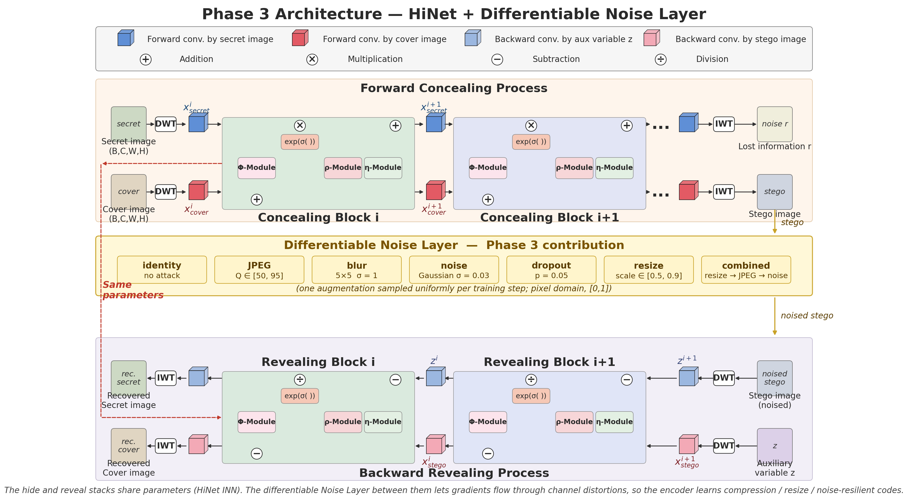

# HiNet: Deep Image Hiding by Invertible Network

This repository contains a refactored implementation of
[**HiNet: Deep Image Hiding by Invertible Network**](https://openaccess.thecvf.com/content/ICCV2021/html/Jing_HiNet_Deep_Image_Hiding_by_Invertible_Network_ICCV_2021_paper.html)
(Junpeng Jing, Xin Deng, Mai Xu, Jianyi Wang, Zhenyu Guan — ICCV 2021,
[MC2 Lab](http://buaamc2.net/) @ Beihang University).

The original paper code has been restructured into a modular `src/` package with
a multi-stage training driver and a post-training attack-robustness evaluation
script. The unmodified reference implementation is preserved under
[`legacy/`](legacy/) for comparison.

- **Project report:** [`docs/report.pdf`](docs/report.pdf) — full write-up of
  the Nexus-Steg pipeline, training stages, and evaluation results.
- **Live demo:** [nexus-hinet-app.streamlit.app](https://nexus-hinet-app.streamlit.app/)
  — hosted Streamlit app that loads a trained checkpoint and lets you
  hide/reveal images interactively in the browser.
- **Demo source:** [Nexus-Hinet-Streamlit](https://github.com/hariharan-sabapathi/Nexus-Hinet-Streamlit)
  — codebase for the Streamlit app above.

<center>
  
</center>

The Phase 3 variant in this repository extends HiNet with a differentiable
noise layer inserted between the hide and reveal stacks, so gradients flow
through channel distortions (JPEG, blur, additive noise, dropout, resize, and
a combined social-media pipeline) and the network learns noise-resilient
codes:

<center>
  
</center>

## Project layout

```
.
├── main.py                 # training entry point (multi-stage, noise layer, gradient safety)
├── evaluate.py             # post-training evaluation with attack robustness suite
├── src/
│   ├── core/               # device manager
│   ├── data/               # DIV2K data pipeline
│   ├── engine/             # trainer (loss, optimizer, validation, SSIM/PSNR)
│   └── models/             # HiNet, invertible block, dense block, DWT/IWT, noise layer
├── scripts/
│   ├── download_div2k.sh   # DIV2K dataset download helper
│   ├── BatchHiNet-*.sh     # SLURM batch jobs for the UB-HPC cluster (CSE676)
│   └── HiNet_Colab.ipynb   # Google Colab variant of the walkthrough notebook
├── HiNet.ipynb             # local end-to-end walkthrough notebook
├── legacy/                 # original ICCV-2021 reference code (kept for reference)
├── datasets/               # DIV2K_train_HR/ and DIV2K_valid_HR/ (gitignored)
├── checkpoints/            # hinet_best.pth, hinet_epoch_*.pth, emergency saves (gitignored)
├── results/                # epoch sample grids, training_log.csv, evaluation/ (gitignored)
├── pyproject.toml          # project metadata and dependencies
└── environment.yml         # optional Conda environment
```

## Install

Requires Python ≥ 3.10. With `pip` (or `uv`):

```bash
pip install -e .
```

Optional visualization extras (`torchviz`, `graphviz`):

```bash
pip install -e ".[viz]"
```

Or with Conda using the bundled environment file:

```bash
conda env create -f environment.yml
conda activate hinet
```

## Dataset

The default training/validation paths in `main.py` are
`datasets/DIV2K_train_HR/` and `datasets/DIV2K_valid_HR/`. A helper script is
included to fetch DIV2K:

```bash
bash scripts/download_div2k.sh
```

You can override the paths via `--train_dir` and `--val_dir`.

## Training

The training is split into two stages: a long clean-training warmup, followed
by a noise-robust fine-tuning phase that resumes from the stage-1 checkpoint.

### Stage 1 — clean training (no noise layer), 2000 epochs

```bash
python3 main.py --epochs 2000 --batch_size 16 \
    --checkpoint_every 10 --val_freq 10 --lr 3.16e-5
```

This trains HiNet at the original paper learning rate
(`10^-4.5 ≈ 3.16e-5`), saves a checkpoint every 10 epochs to
`checkpoints/hinet_epoch_*.pth`, validates every 10 epochs, and tracks the best
PSNR(secret) checkpoint as `checkpoints/hinet_best.pth`. A per-epoch row is
appended to `results/training_log.csv` and a sample grid is written to
`results/epoch_<N>.png` on every validation step.

### Stage 2 — noise-robust fine-tuning, resume from stage 1

```bash
python3 main.py --epochs 1000 --batch_size 16 \
    --checkpoint_every 10 --val_freq 10 \
    --resume model/hinet_trained_till_2000.pth \
    --lr 2e-6 --start_epoch 0 \
    --noise --jpeg_quality_min 50 --jpeg_quality_max 95
```

This fine-tunes the stage-1 checkpoint for another 1000 epochs at a lower
learning rate (`2e-6`) with the differentiable noise layer enabled, sampling
JPEG quality uniformly in `[50, 95]` per step. Adjust `--resume` to point at
your stage-1 output.

### Diagnostic flags

- `--sanity` — run a Karpathy-style sanity check (saves `results/sanity_inputs.png`,
  prints initial losses) and exits.
- `--overfit_one_batch` — overfit a single batch for 500 steps to verify model
  capacity, and exits.
- `--no_grad_safety` — disable gradient clipping and the watchdog (exact paper
  reproduction). The default `--max_grad_norm 10.0` and watchdog factor `5.0`
  protect against the loss explosions described in the original training demo.

## Evaluation

After training, run the attack-robustness suite:

```bash
python evaluate.py --checkpoint checkpoints/hinet_best.pth
```

This evaluates the model under the following attacks (defined in
`evaluate.py::ATTACKS`) and writes PSNR / SSIM per attack to
`results/evaluation/report.txt`, plus a side-by-side sample strip per attack:

- `clean` — no attack
- `jpeg_90`, `jpeg_50` — real PIL JPEG compression
- `blur` — Gaussian blur (radius 2)
- `noise` — additive Gaussian noise (σ = 0.03)
- `resize_50`, `resize_75` — bilinear down/upscale
- `social` — combined resize 0.75 + JPEG 70 (social-media-like pipeline)

Each attack is graded `PASS` (>28 dB), `WARN` (>20 dB), or `FAIL`.

## Results

These numbers come from `results/evaluation/report.txt` for a model trained
with the Stage 1 schedule (1000 epochs, clean, `lr=3.16e-5`,
`val_crop_size=1024`) and evaluated on the DIV2K validation set:

| Attack      | PSNR (dB) | SSIM    | Grade |
| ----------- | --------- | ------- | ----- |
| `clean`     | 30.42     | 0.9207  | PASS  |
| `jpeg_90`   | 24.16     | 0.7039  | WARN  |
| `jpeg_50`   | 21.24     | 0.5692  | WARN  |
| `blur`      | 19.56     | 0.6414  | FAIL  |
| `noise`     | 26.10     | 0.7464  | WARN  |
| `resize_50` | 19.90     | 0.6778  | FAIL  |
| `resize_75` | 21.16     | 0.7438  | WARN  |
| `social`    | 19.52     | 0.5959  | FAIL  |

The clean baseline reaches paper-comparable quality, while the unprotected
Stage 1 model degrades under non-trivial channel attacks — which is exactly
the motivation for the Stage 2 noise-aware fine-tuning step. Stage 1 final
training metrics (epoch 1000, from `results/training_log.csv`):
PSNR(stego) = 25.20 dB, SSIM(stego) = 0.7192, PSNR(secret) = 32.08 dB,
SSIM(secret) = 0.9310.

Each evaluation strip below shows, left to right:
**cover · secret · stego · attacked stego · revealed secret**.

Clean (no attack — best case):


`social` attack (resize 0.75 + JPEG 70 — worst case from the suite):


The full-resolution strips for every attack are written to
`results/evaluation/<attack>.png` when you run `evaluate.py`.

## Scripts

The [`scripts/`](scripts/) folder contains a dataset helper plus the SLURM batch
jobs used to run training on the UB-HPC `ub-hpc` cluster (CSE676 account). Each
batch script stages the project into `/scratch/<username>/`, unzips DIV2K, loads
the cluster's `pytorch` / `torchvision` / `pillow` / `jax` / `tqdm` modules,
runs `main.py` with a specific configuration, and finally copies `results/`
and `checkpoints/` back to the project share.

- `download_div2k.sh` — downloads and extracts DIV2K train + valid HR sets into
  `datasets/` (idempotent: skips if the folders already exist).
- `BatchHiNet-Full-Training-2000.sh` — Stage 1 reference: 2000 epochs of clean
  training at `lr=3.16e-5`.
- `BatchHiNet-Noise-50-95-LR-1e-5-FromScratch.sh` — noise-aware training from
  scratch, 1000 epochs at `lr=1e-5`, JPEG quality 50–95.
- `BatchHiNet-Noise-50-95-LR-2e-6-Resume2000.sh` — Stage 2 reference: noise
  fine-tuning resumed from `model/hinet_trained_till_2000.pth` at `lr=2e-6`,
  JPEG quality 50–95.
- `BatchHiNet-Noise-Decopuled-70-95-LR-1e-6-1e-4-200.sh` — decoupled-reveal
  experiment (`--decoupled_reveal`): hide branch frozen for 10 epochs at
  `lr=1e-6`, reveal branch at `reveal_lr=1e-4`, JPEG 70–95, 200 epochs.

If you don't run on UB-HPC, treat the batch scripts as documented examples of
the full `main.py` invocations rather than ready-to-run jobs — the `#SBATCH`
header, `module load` lines, and paths are cluster-specific.

## Legacy reference code

The original ICCV-2021 reference implementation (`train.py`, `test.py`,
`config.py`, `hinet.py`, `model.py`, etc.) has been moved into
[`legacy/`](legacy/) for reference. See [`legacy/README.md`](legacy/README.md)
for usage notes.

## Citation

```
@InProceedings{Jing_2021_ICCV,
    author    = {Jing, Junpeng and Deng, Xin and Xu, Mai and Wang, Jianyi and Guan, Zhenyu},
    title     = {HiNet: Deep Image Hiding by Invertible Network},
    booktitle = {Proceedings of the IEEE/CVF International Conference on Computer Vision (ICCV)},
    month     = {October},
    year      = {2021},
    pages     = {4733-4742}
}
```
